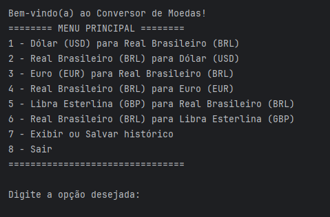
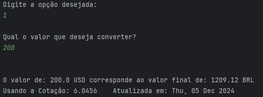
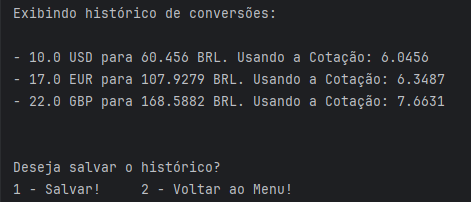
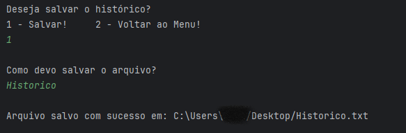

# Conversor de Moeda 💱

Bem-vindo ao Conversor de Moeda! Este projeto foi desenvolvido como parte do Challenge Conversor de Moeda, que integra a formação em programação da Alura na trilha ONE 7 - Oracle Next Education.

---

---

## Funcionalidades ⚙️

- **Conversão de Moeda**: Converte valores entre diferentes moedas utilizando a API ExchangeRate. 🌍
- **Histórico de Conversões**: Armazena o histórico das conversões realizadas, exibindo-os ao usuário. 🗂️
- **Salvar Histórico**: Permite ao usuário salvar o histórico de conversões em um arquivo de texto no seu computador. 💾
- **Consulta em Tempo Real**: Realiza as conversões de moeda com base nas taxas de câmbio mais recentes. 📈
- **Tratamento de Erro**: Gerencia erros de entrada, falhas na conexão com a API via HTTPS e problemas na conversão de dados com o Gson para manipulação de JSON. 🚨

---

## Como Usar 📝

1. **Selecione uma opção de conversão**: Escolha uma opção de conversão. 💡
2. **Insira o Valor**: Informe o valor que deseja converter. 💰
3. **Após informar um valor valido**: A ferramenta calculará automaticamente o valor convertido e exibirá o resultado. 🔄

---

4. **Exibir Histórico**: O histórico das conversões pode ser acessado e exibido. 📜

___

5. **Salvar Histórico**: Você pode salvar o histórico das conversões em um arquivo de texto. 📝

---

## Estrutura do Projeto 🗂️

- `exchangerateapi`: Interage com a API ExchangeRate para obter taxas de câmbio. 🌐
- `modelo`: Contém as classes relacionadas às moedas e ao histórico. 💡
- `principal`: Contém a execução principal do programa. 🎯

## Requisitos ⚙️

- JDK 8 ou superior. ☕
- Conexão com a internet (para consultar a API ExchangeRate). 🌍

## Tecnologias Utilizadas 🖥️

- **Java 8+**: Para desenvolvimento da aplicação. ☕
- **API ExchangeRate**: Para obter as taxas de câmbio em tempo real. 🌐
- **Gson**: Para manipulação de JSON. 📑
- **File I/O**: Para salvar o histórico em arquivos de texto. 💾
- **ChatGPT**: Otimizando os resultados e auxiliando no desenvolvimento. 🤖

## Créditos 🎉

- **Desenvolvido por**: Kaio Victor 
- **Design Inspirado por**: Alura 

## Licença 📜

Este projeto é licenciado sob os termos da licença MIT. 🎓
